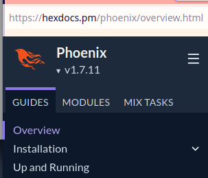

# Links

This could be a browser bookmarks file, but let's start with
a tabular list of links.

| Name | Link | Description | Search |
|------|------|-------------|--------|
| Elixir | [elixir-lang](https://elixir-lang.org/) | Elixir language home | [g elixir language](https://www.google.com/search?q=elixir+language)
| hexdocs | [hexdocs.pm](https://hexdocs.pm) | Elixir package docs (pm = pkg mgr)| |
| mix | hexdocs [mix 1.14](https://hexdocs.pm/mix/1.14/Mix.html) | mix is an Elixir make command | [g elixir mix](https://www.google.com/search?q=elixir+mix) |
| Phoenix | [phoenix framework](https://www.phoenixframework.org/) | Phoenix web framework for Elixir | [g elixir phoenix](https://www.google.com/search?q=elixir+phoenix) |
| Phoenix | [docs overview](https://hexdocs.pm/phoenix/overview.html) | Hexdocs overview of Phoenix |  |
| phoenix gen | [phoenix_generator](https://hexdocs.pm/phoenix_generator/overview.html) | mix tasks to generate Phoenix bits | |


**Phoenix How-to Guides**

| Guide        | Link | Description |
|--------------|------|-------------|
| Installation | [Installation](https://hexdocs.pm/phoenix/installation.html) | Erlang 24+, Elixir 1.14+, Phoenix, phx.new mix tasks |
| Running      | [Up and Running](https://hexdocs.pm/phoenix/up_and_running.html) | `mix phx.new wiki` possibly `--no-ecto` |
| mix phx.new  | [hexdocs phx.new](https://hexdocs.pm/phoenix/Mix.Tasks.Phx.New.html) | new Phoenix app mix task docs/opts |
| mix tasks    | [mix tasks](https://hexdocs.pm/phoenix/mix_tasks.html) | guide to mix tasks for Phoenix and Ecto |
| Testing      | [Testing](https://hexdocs.pm/phoenix/testing.html) | contexts for testing etc |
| Deployment   | [Deployment](https://hexdocs.pm/phoenix/deployment.html) | build and deploy, secrets management, cloud app hosts |
| Releases     | [Releases]( ) | including schema migration and such |

 

Results of "mix phx.new wiki"
```
We are almost there! The following steps are missing:

    $ cd wiki

Then configure your database in config/dev.exs and run:

    $ mix ecto.create

Start your Phoenix app with:

    $ mix phx.server

You can also run your app inside IEx (Interactive Elixir) as:

    $ iex -S mix phx.server
```
