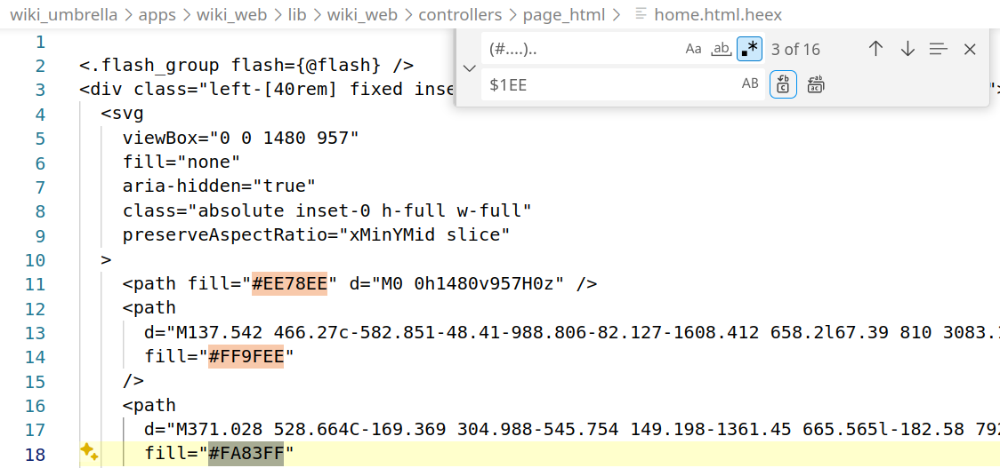

# log.md - Project Log

Wed 28 Feb 2024 11:23:56 AM PST
* Set up project structure and README with goals and initial tasks.
* Create progress directory with [log.md](./log.md) (this file) and [tasks](./tasks.md).

Wed 28 Feb 2024 01:15:08 PM PST
* `:r! date` in vi/Unix to datestamp (a reminder). There's a vim builtin too.
* Initial commit with a break-out of [goals](../goals.md) and [taskflow](../taskflow.md).

Thu 29 Feb 2024 02:20:38 PM PST
* Setting up to pair and do an initial install of a Phoenix project `mix phx.new wiki`
* Walked through plan, did an initial `mix phx.new --no-ecto wiki` (deferring DB config).

Thu 29 Feb 2024 03:39:34 PM PST
* Switched from "cowboy" to "bandit" for HTTP interface. See [Bandit.PhoenixAdapter](https://hexdocs.pm/bandit/Bandit.PhoenixAdapter.html). Needed a `mix deps.get`. Removed the Cowboy plug dep.

Wed 20 Mar 2024 09:46:12 AM PDT
* Earlier this week: updated Erlang/OTP and Phoenix versions.
```
Erlang/OTP 26 [erts-14.2.3] [source] [64-bit] [smp:8:8] [ds:8:8:10] [async-threads:1] [jit:ns]

Mix 1.16.2 (compiled with Erlang/OTP 26)
IEx 1.16.2 (compiled with Erlang/OTP 26)
```

Finding out what the new Phoenix install instructions are.

Old instructions work well! There is now a module split under an umbrella directory.

```
  mix archive.install hex phx_new
  mix help phx.new
  mix phx.new --umbrella --no-ecto wiki 
  cd wiki_umbrella/
  mix phx.server
```

Installed inotify-tools supporting the Phoenix server detecting filesystem
changes to support hot reload. `apt info inotify-tools`, `man -k inotify`

Elixir/Phoenix example from LogRocket blog, [Elixir/Phoenix REST API](https://blog.logrocket.com/build-rest-api-elixir-phoenix) 

Using VSCode for regexp search and replace. We're taking every color of the form `#......` and replacing the last two characters (blue level) with `EE`. VSCode uses `$1` to refer to the first capture group in the replacement expression.



(paired with Mani S.) 
